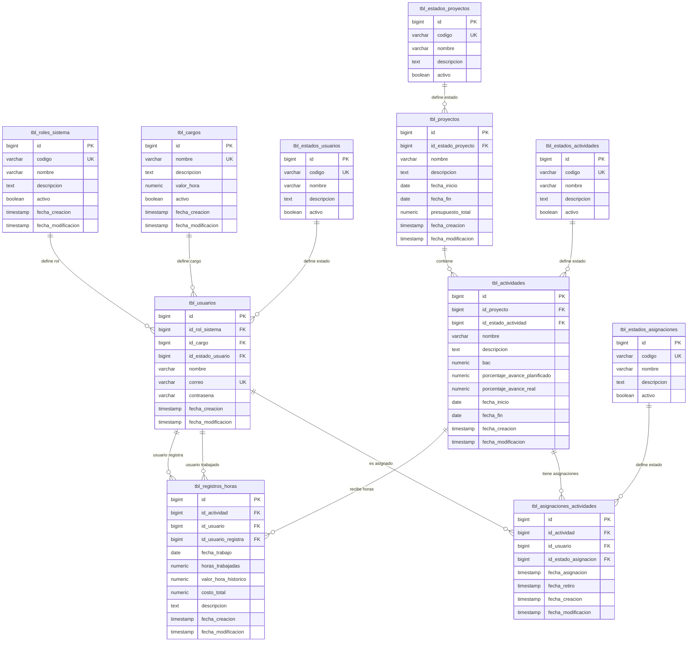

# Modelo de Base de Datos

## Objetivo del documento

Este documento define el modelo inicial de base de datos para el sistema de gestión de proyectos, actividades, asignaciones, registro de horas y análisis EVM.

Copilot debe usar este documento como fuente principal para generar:

- Entidades JPA.
- Migraciones Liquibase.
- DTOs relacionados con persistencia.
- Repositories.
- Relaciones entre tablas.
- Validaciones de integridad.
- Consultas necesarias para el cálculo EVM.

No se deben crear tablas, campos, relaciones, estados ni tipos de datos que no estén definidos en este documento.

---

# Motor de base de datos

El motor de base de datos será:

```text
PostgreSQL
```

---

# Convenciones generales

## Nombres de tablas

Todas las tablas deben cumplir:

- Estar en español.
- Estar en plural.
- Iniciar con el prefijo `tbl_`.
- Usar `snake_case`.
- Escribirse en minúscula para evitar problemas de comillas en PostgreSQL.

Ejemplos:

```text
tbl_proyectos
tbl_actividades
tbl_registros_horas
```

---

## Nombres de campos

Todos los campos deben cumplir:

- Estar en español.
- Usar `snake_case`.
- Ser descriptivos.
- Evitar abreviaciones innecesarias.

Ejemplos:

```text
fecha_inicio
presupuesto_total
porcentaje_avance_real
```

---

## Llaves primarias

Todas las llaves primarias deben llamarse:

```text
id
```

Tipo recomendado:

```text
bigint
```

---

## Llaves foráneas

Todas las llaves foráneas deben iniciar con:

```text
id_
```

Ejemplos:

```text
id_proyecto
id_actividad
id_usuario
id_estado_proyecto
```

---

# Separación de estados del sistema

El sistema manejará dos tipos de estados:

1. Estados operativos.
2. Estados calculados EVM.

---

## Estados operativos

Los estados operativos representan el ciclo de vida administrativo de los registros.

Estos estados SÍ se almacenan en base de datos mediante tablas catálogo.

Ejemplos:

- Estado de proyecto.
- Estado de actividad.
- Estado de usuario.
- Estado de asignación.

Estos estados permiten controlar si un registro está activo, pausado, finalizado, cancelado, inactivo o retirado.

---

## Estados calculados EVM

Los estados calculados EVM representan la interpretación financiera y de cronograma del proyecto o actividad.

Estos estados NO se almacenan en base de datos.

Se calculan dinámicamente a partir de:

- BAC.
- PV.
- EV.
- AC.
- CPI.
- SPI.
- Registros de horas.
- Avance planificado.
- Avance real.

Ejemplos:

- Saludable.
- En riesgo.
- Bajo presupuesto.
- Sobre presupuesto.
- Adelantado.
- Retrasado.

---

## Regla obligatoria sobre estados EVM

Copilot no debe crear campos físicos como:

```text
estado_evm
estado_financiero
estado_cronograma
riesgo_evm
```

La interpretación EVM debe retornarse mediante DTOs de respuesta, no persistirse en tablas.

---

# Reglas sobre datos persistidos y calculados

## Datos que sí se persisten

El sistema debe persistir únicamente datos fuente del negocio, como:

- Proyectos.
- Actividades.
- Usuarios.
- Cargos.
- Roles de sistema.
- Asignaciones.
- Registros de horas.
- Valores históricos necesarios para auditoría.
- Estados operativos.

---

## Datos que NO se persisten

No se deben persistir indicadores EVM derivados.

Los siguientes valores deben calcularse dinámicamente:

| Indicador | Persistir en BD |
|---|---|
| PV | No |
| EV | No |
| AC calculado | No |
| CV | No |
| SV | No |
| CPI | No |
| SPI | No |
| EAC | No |
| VAC | No |

Estos valores deben calcularse desde:

- `tbl_actividades.bac`.
- `tbl_actividades.porcentaje_avance_planificado`.
- `tbl_actividades.porcentaje_avance_real`.
- `tbl_registros_horas.horas_trabajadas`.
- `tbl_registros_horas.valor_hora_historico`.
- `tbl_registros_horas.costo_total`.

---

# Modelo de tablas

## MER completo del modelo

Este MER representa la estructura relacional base del sistema.

Incluye:

- Roles de sistema.
- Cargos.
- Estados operativos.
- Usuarios.
- Proyectos.
- Actividades.
- Asignaciones.
- Registros de horas.

No incluye indicadores EVM derivados porque estos no se almacenan en base de datos.

---

## Diagrama MER



---

## Lectura funcional del MER

El modelo se interpreta de la siguiente manera:

```text
Un rol de sistema puede pertenecer a muchos usuarios.
Un cargo puede pertenecer a muchos usuarios.
Un estado de usuario puede pertenecer a muchos usuarios.

Un estado de proyecto puede pertenecer a muchos proyectos.
Un proyecto puede contener muchas actividades.

Un estado de actividad puede pertenecer a muchas actividades.
Una actividad puede tener muchas asignaciones.
Un usuario puede tener muchas asignaciones.
Un estado de asignación puede pertenecer a muchas asignaciones.

Una actividad puede tener muchos registros de horas.
Un usuario puede tener muchos registros de horas como usuario trabajado.
Un usuario puede tener muchos registros de horas como usuario que registra.
```

---

## Relaciones y cardinalidades

| Relación | Cardinalidad | Descripción |
|---|---|---|
| tbl_roles_sistema → tbl_usuarios | 1:N | Un rol de sistema puede estar asociado a muchos usuarios |
| tbl_cargos → tbl_usuarios | 1:N | Un cargo puede estar asociado a muchos usuarios |
| tbl_estados_usuarios → tbl_usuarios | 1:N | Un estado puede estar asociado a muchos usuarios |
| tbl_estados_proyectos → tbl_proyectos | 1:N | Un estado puede estar asociado a muchos proyectos |
| tbl_proyectos → tbl_actividades | 1:N | Un proyecto puede contener muchas actividades |
| tbl_estados_actividades → tbl_actividades | 1:N | Un estado puede estar asociado a muchas actividades |
| tbl_actividades → tbl_asignaciones_actividades | 1:N | Una actividad puede tener muchos usuarios asignados |
| tbl_usuarios → tbl_asignaciones_actividades | 1:N | Un usuario puede estar asignado a muchas actividades |
| tbl_estados_asignaciones → tbl_asignaciones_actividades | 1:N | Un estado puede estar asociado a muchas asignaciones |
| tbl_actividades → tbl_registros_horas | 1:N | Una actividad puede tener muchos registros de horas |
| tbl_usuarios → tbl_registros_horas | 1:N | Un usuario puede tener muchos registros como usuario trabajado |
| tbl_usuarios → tbl_registros_horas | 1:N | Un usuario puede tener muchos registros como usuario que registra |

---

## Reglas derivadas del MER

### Regla 1: usuario trabajado y usuario que registra

En `tbl_registros_horas` existen dos relaciones hacia `tbl_usuarios`:

```text
id_usuario
id_usuario_registra
```

Donde:

- `id_usuario` representa el usuario por quien se registran las horas.
- `id_usuario_registra` representa el usuario autenticado que hizo el registro.

Esto permite que:

- Un colaborador registre sus propias horas.
- Un líder registre horas en nombre de un colaborador.

---

### Regla 2: asignación requerida para registrar horas

Un usuario solo puede registrar horas sobre una actividad si existe una asignación activa entre:

```text
tbl_actividades
tbl_usuarios
```

mediante:

```text
tbl_asignaciones_actividades
```

---

### Regla 3: cargo y valor hora

El valor hora actual del usuario se obtiene desde:

```text
tbl_usuarios → tbl_cargos.valor_hora
```

Al crear un registro de horas, este valor se copia en:

```text
tbl_registros_horas.valor_hora_historico
```

---

### Regla 4: costo total histórico

El campo:

```text
tbl_registros_horas.costo_total
```

se calcula al momento de crear o actualizar el registro:

```text
horas_trabajadas * valor_hora_historico
```

Este valor se almacena para trazabilidad histórica.

---

### Regla 5: indicadores EVM no forman parte del MER físico

Los indicadores:

```text
PV, EV, AC, CV, SV, CPI, SPI, EAC, VAC
```

no aparecen como columnas ni tablas porque son valores calculados dinámicamente.


# Datos semilla iniciales

Esta sección define los datos mínimos que deben existir al inicializar la base de datos.

Estos datos permiten que el sistema pueda funcionar desde el primer arranque con:

- Roles de sistema.
- Cargos base.
- Estados de usuarios.
- Estados de proyectos.
- Usuarios iniciales de prueba.

Los datos aquí definidos deben ser creados mediante Liquibase.

---

# tbl_roles_sistema

Tabla encargada de definir los roles funcionales del sistema.

## Datos iniciales

| id | codigo | nombre | descripcion | activo |
|---:|---|---|---|---|
| 1 | LIDER | Líder | Usuario con permisos para gestionar proyectos, actividades, asignaciones, registros de horas e indicadores generales. | true |
| 2 | COLABORADOR | Colaborador | Usuario con permisos para consultar actividades asignadas, registrar horas propias y consultar indicadores de sus actividades. | true |

---

# tbl_cargos

Tabla encargada de definir los cargos laborales y su valor hora.

## Datos iniciales

| id | nombre | descripcion | valor_hora | activo |
|---:|---|---|---:|---|
| 1 | Líder de Proyecto | Cargo responsable de liderar proyectos, coordinar actividades y registrar seguimiento general. | 150000.00 | true |
| 2 | Desarrollador Senior | Cargo técnico encargado de implementar funcionalidades de alta complejidad. | 120000.00 | true |
| 3 | Desarrollador Junior | Cargo técnico encargado de apoyar la implementación de funcionalidades. | 60000.00 | true |
| 4 | QA | Cargo encargado de pruebas funcionales, validación de calidad y reporte de hallazgos. | 80000.00 | true |
| 5 | Analista Funcional | Cargo encargado de levantamiento, análisis y validación funcional. | 90000.00 | true |

---

# tbl_estados_usuarios

Tabla catálogo para definir los estados operativos de los usuarios.

## Datos iniciales

| id | codigo | nombre | descripcion | activo |
|---:|---|---|---|---|
| 1 | ACTIVO | Activo | Usuario habilitado para ingresar y operar en el sistema. | true |
| 2 | INACTIVO | Inactivo | Usuario deshabilitado administrativamente. No puede ingresar ni operar en el sistema. | true |
| 3 | BLOQUEADO | Bloqueado | Usuario bloqueado por razones de seguridad o control administrativo. | true |

---

# tbl_estados_proyectos

Tabla catálogo para definir los estados operativos de los proyectos.

## Datos iniciales

| id | codigo | nombre | descripcion | activo |
|---:|---|---|---|---|
| 1 | ACTIVO | Activo | Proyecto en ejecución y habilitado para gestionar actividades, asignaciones y registros de horas. | true |
| 2 | PAUSADO | Pausado | Proyecto suspendido temporalmente. No debe permitir nuevas actividades ni registros operativos hasta ser reactivado. | true |
| 3 | FINALIZADO | Finalizado | Proyecto terminado. Solo debe permitir consulta histórica e indicadores finales. | true |
| 4 | CANCELADO | Cancelado | Proyecto cancelado. No debe permitir operación activa. | true |

---

# tbl_usuarios

Tabla encargada de almacenar los usuarios iniciales del sistema.

## Usuarios iniciales

Se crearán dos usuarios iniciales:

1. Un usuario líder.
2. Un usuario colaborador.

Las contraseñas deben almacenarse siempre encriptadas.  
Los valores mostrados en esta tabla son referenciales para documentación y no deben insertarse en texto plano.

## Datos iniciales

| id | id_rol_sistema | id_cargo | id_estado_usuario | nombre | correo | contrasena | Descripción |
|---:|---:|---:|---:|---|---|---|---|
| 1 | 1 | 1 | 1 | Líder Demo | lider.demo@evm.local | Encriptada | Usuario inicial con rol LIDER y cargo Líder de Proyecto. |
| 2 | 2 | 2 | 1 | Colaborador Demo | colaborador.demo@evm.local | Encriptada | Usuario inicial con rol COLABORADOR y cargo Desarrollador Senior. |

---

# Credenciales iniciales sugeridas para ambiente local

Estas credenciales solo deben usarse en ambiente local o de desarrollo.

| Usuario | Correo | Contraseña inicial sugerida |
|---|---|---|
| Líder Demo | lider.demo@evm.local | Admin123* |
| Colaborador Demo | colaborador.demo@evm.local | User123* |

---

# Regla obligatoria sobre contraseñas

Las contraseñas nunca deben guardarse en texto plano.

Antes de insertar usuarios iniciales, el backend o el changelog de inicialización debe almacenar la contraseña usando el mecanismo de encriptación definido por Spring Security.

Ejemplo conceptual:

```text
BCrypt(Admin123*)
BCrypt(User123*)
```

---

# Consideraciones para Liquibase

Los datos semilla deben insertarse en este orden:

```text
1. tbl_roles_sistema
2. tbl_cargos
3. tbl_estados_usuarios
4. tbl_estados_proyectos
5. tbl_usuarios
```

La tabla `tbl_usuarios` depende de:

- `tbl_roles_sistema`
- `tbl_cargos`
- `tbl_estados_usuarios`

Por lo tanto, no debe insertarse antes de esas tablas.

---

# Regla de idempotencia

Los inserts iniciales deben ser idempotentes.

Esto significa que si el changelog se ejecuta nuevamente, no debe duplicar datos.

Se recomienda validar por campos únicos como:

```text
codigo
correo
nombre
```

Ejemplos:

- `tbl_roles_sistema.codigo`
- `tbl_estados_usuarios.codigo`
- `tbl_estados_proyectos.codigo`
- `tbl_usuarios.correo`
- `tbl_cargos.nombre`